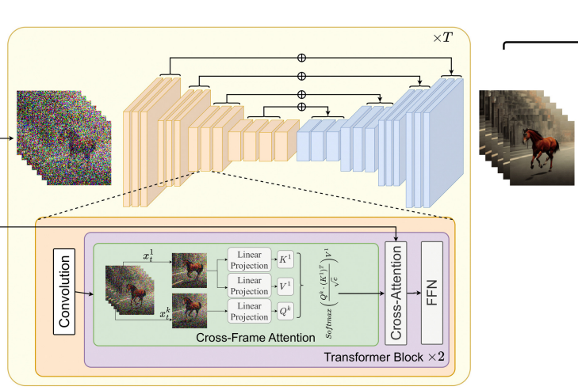

# Analysis Report - Video Portrait Subject Editing

## Goal

Edit the subject of a talking portrait video given an edit prompt while maintaining high fidelity (using Diffusion Models)

](imgs/Untitled.png)

Source: [https://ustc3dv.github.io/CosAvatar/](https://ustc3dv.github.io/CosAvatar/)

## **Challenges:**

- Maintaining High Fidelity
    - Maintaining Lip movements, gestures and other expressions
    - Background, Lighting etc.
- Deformed Eyes, Faces, Fingers (Stable Diffusion - v1.5)
- Temporal Consistency of Edits across the video
- Maintain the original resolution / picture quality

## **Related Work:**

There are two groups of approaches found in the literature:

### 2D Editing + 2D Rendering

- Perform Frame level Edits using Text2Image (T2I) models
    - Eg. [Prompt2Prompt](https://arxiv.org/abs/2208.01626), [InstructPix2Pix](https://arxiv.org/abs/2211.09800), [ControlNet](https://openaccess.thecvf.com/content/ICCV2023/html/Zhang_Adding_Conditional_Control_to_Text-to-Image_Diffusion_Models_ICCV_2023_paper.html), etc.
- Stitch the frames together to generate Video maintaining temporal consistency
    - With FineTuning
        - [Tune-A-Video](https://openaccess.thecvf.com/content/ICCV2023/html/Wu_Tune-A-Video_One-Shot_Tuning_of_Image_Diffusion_Models_for_Text-to-Video_Generation_ICCV_2023_paper.html), [Text2Live](https://link.springer.com/chapter/10.1007/978-3-031-19784-0_41), [CCEdit](https://arxiv.org/abs/2309.16496) etc.
    - Without FineTuning (Zero-Shot)
        - Eg. [Pix2Video](https://openaccess.thecvf.com/content/ICCV2023/html/Ceylan_Pix2Video_Video_Editing_using_Image_Diffusion_ICCV_2023_paper.html), [TokenFlow](https://arxiv.org/abs/2307.10373), [Text2Video_Zero](https://arxiv.org/abs/2303.13439), [ControlVideo](https://arxiv.org/abs/2305.13077), etc.

### 2D Editing + 3D Rendering

- Perform Face Edits using Text2Image Models (like InstructPix2Pix)
- Render the Edits in 3D using Dynamic NERF
- Advantages: Better temporal and 3D consistency
- Examples
    - [CosAvatar](https://arxiv.org/abs/2311.18288), [AvatarStudio](https://arxiv.org/abs/2306.00547), etc.

## Approach

- The approach taken in this work is based on [Text2Video_Zero](https://arxiv.org/abs/2303.13439) framework
    
    
    
    - Edit Frames using T2I Model - InstructPix2Pix, [ControlNet](https://openaccess.thecvf.com/content/ICCV2023/html/Zhang_Adding_Conditional_Control_to_Text-to-Image_Diffusion_Models_ICCV_2023_paper.html)
    - Use Cross-Frame Attention for enforcing appearance consistency across video frames
    
    ### Setup -1 : Using Instruct Pix2Pix as T2I backbone
    
    - Input - Original Frame, Prompt: Turn the woman's clothes to superman costume
        
        
        
    - Output
        
        
        
    
    ### Setup-2: Using Canny Edge Condition ControlNet as T2I backbone
    
    - Original
        
        
        
    - Input - Canny Edge Map Conditioning, Prompt: Girl in Superman Costume
        
        
        
    - Output
        
        
        
    

## Improvement Areas

- For ControlNet Model, Explore:
    - Face Landmark/Pose conditioning for preserving lip movement and facial expressions
    - RealisticVision Stable Diffusion checkpoints to generate realistic portraits
    - Portrait masking to preserve background
- For InstructPix2Pix
    - Has the best perceptually best edits, but fails to maintain coherent appearance across frames
    - Explore better video diffusion / frame interaction approaches to improve temporal appearance consistency, like [TokenFlow](https://arxiv.org/abs/2307.10373)
- General
    - StableDiffusion-1.5 ruins faces if the face is smaller w.r.t entire image frame - Explore separate face and body generation
    - Explore fine-tuning/adaptation with Video specific training for best results
    - Explore 3D Rendering based approaches like [CosAvatar](https://arxiv.org/abs/2311.18288)

## **References**

Bar-Tal, O., Ofri-Amar, D., Fridman, R., Kasten, Y., & Dekel, T. (2022). Text2LIVE: Text-Driven Layered Image and Video Editing. In S. Avidan, G. Brostow, M. Cissé, G. M. Farinella, & T. Hassner (Eds.), *Computer Vision – ECCV 2022* (pp. 707–723). Springer Nature Switzerland. [https://doi.org/10.1007/978-3-031-19784-0_41](https://doi.org/10.1007/978-3-031-19784-0_41)

Brooks, T., Holynski, A., & Efros, A. A. (2023). *InstructPix2Pix: Learning to Follow Image Editing Instructions* (arXiv:2211.09800). arXiv. [https://doi.org/10.48550/arXiv.2211.09800](https://doi.org/10.48550/arXiv.2211.09800)

Ceylan, D., Huang, C.-H. P., & Mitra, N. J. (2023). *Pix2Video: Video Editing using Image Diffusion*. 23206–23217. [https://openaccess.thecvf.com/content/ICCV2023/html/Ceylan_Pix2Video_Video_Editing_using_Image_Diffusion_ICCV_2023_paper.html](https://openaccess.thecvf.com/content/ICCV2023/html/Ceylan_Pix2Video_Video_Editing_using_Image_Diffusion_ICCV_2023_paper.html)

Chu, E., Huang, T., Lin, S.-Y., & Chen, J.-C. (2023). *MeDM: Mediating Image Diffusion Models for Video-to-Video Translation with Temporal Correspondence Guidance* (arXiv:2308.10079). arXiv. [https://doi.org/10.48550/arXiv.2308.10079](https://doi.org/10.48550/arXiv.2308.10079)

Feng, R., Weng, W., Wang, Y., Yuan, Y., Bao, J., Luo, C., Chen, Z., & Guo, B. (2023). *CCEdit: Creative and Controllable Video Editing via Diffusion Models* (arXiv:2309.16496). arXiv. [https://doi.org/10.48550/arXiv.2309.16496](https://doi.org/10.48550/arXiv.2309.16496)

Geyer, M., Bar-Tal, O., Bagon, S., & Dekel, T. (2023). *TokenFlow: Consistent Diffusion Features for Consistent Video Editing* (arXiv:2307.10373). arXiv. [https://doi.org/10.48550/arXiv.2307.10373](https://doi.org/10.48550/arXiv.2307.10373)

Haque, A., Tancik, M., Efros, A. A., Holynski, A., & Kanazawa, A. (2023). *Instruct-NeRF2NeRF: Editing 3D Scenes with Instructions* (arXiv:2303.12789). arXiv. [https://doi.org/10.48550/arXiv.2303.12789](https://doi.org/10.48550/arXiv.2303.12789)

Hertz, A., Mokady, R., Tenenbaum, J., Aberman, K., Pritch, Y., & Cohen-Or, D. (2022). *Prompt-to-Prompt Image Editing with Cross Attention Control* (arXiv:2208.01626). arXiv. [https://doi.org/10.48550/arXiv.2208.01626](https://doi.org/10.48550/arXiv.2208.01626)

Khachatryan, L., Movsisyan, A., Tadevosyan, V., Henschel, R., Wang, Z., Navasardyan, S., & Shi, H. (2023). *Text2Video-Zero: Text-to-Image Diffusion Models are Zero-Shot Video Generators* (arXiv:2303.13439). arXiv. [https://doi.org/10.48550/arXiv.2303.13439](https://doi.org/10.48550/arXiv.2303.13439)

Liu, S., Zhang, Y., Li, W., Lin, Z., & Jia, J. (2023). *Video-P2P: Video Editing with Cross-attention Control* (arXiv:2303.04761). arXiv. [https://doi.org/10.48550/arXiv.2303.04761](https://doi.org/10.48550/arXiv.2303.04761)

Meng, C., He, Y., Song, Y., Song, J., Wu, J., Zhu, J.-Y., & Ermon, S. (2022). *SDEdit: Guided Image Synthesis and Editing with Stochastic Differential Equations* (arXiv:2108.01073). arXiv. [https://doi.org/10.48550/arXiv.2108.01073](https://doi.org/10.48550/arXiv.2108.01073)

Mendiratta, M., Pan, X., Elgharib, M., Teotia, K., R, M. B., Tewari, A., Golyanik, V., Kortylewski, A., & Theobalt, C. (2023). *AvatarStudio: Text-driven Editing of 3D Dynamic Human Head Avatars* (arXiv:2306.00547). arXiv. [https://doi.org/10.48550/arXiv.2306.00547](https://doi.org/10.48550/arXiv.2306.00547)

Qi, C., Cun, X., Zhang, Y., Lei, C., Wang, X., Shan, Y., & Chen, Q. (2023). *FateZero: Fusing Attentions for Zero-shot Text-based Video Editing* (arXiv:2303.09535). arXiv. [https://doi.org/10.48550/arXiv.2303.09535](https://doi.org/10.48550/arXiv.2303.09535)

Shi, F., Gu, J., Xu, H., Xu, S., Zhang, W., & Wang, L. (2023). *BIVDiff: A Training-Free Framework for General-Purpose Video Synthesis via Bridging Image and Video Diffusion Models* (arXiv:2312.02813). arXiv. [https://doi.org/10.48550/arXiv.2312.02813](https://doi.org/10.48550/arXiv.2312.02813)

Wu, J. Z., Ge, Y., Wang, X., Lei, S. W., Gu, Y., Shi, Y., Hsu, W., Shan, Y., Qie, X., & Shou, M. Z. (2023). *Tune-A-Video: One-Shot Tuning of Image Diffusion Models for Text-to-Video Generation*. 7623–7633. [https://openaccess.thecvf.com/content/ICCV2023/html/Wu_Tune-A-Video_One-Shot_Tuning_of_Image_Diffusion_Models_for_Text-to-Video_Generation_ICCV_2023_paper.html](https://openaccess.thecvf.com/content/ICCV2023/html/Wu_Tune-A-Video_One-Shot_Tuning_of_Image_Diffusion_Models_for_Text-to-Video_Generation_ICCV_2023_paper.html)

Wu, J. Z., Li, X., Gao, D., Dong, Z., Bai, J., Singh, A., Xiang, X., Li, Y., Huang, Z., Sun, Y., He, R., Hu, F., Hu, J., Huang, H., Zhu, H., Cheng, X., Tang, J., Shou, M. Z., Keutzer, K., & Iandola, F. (2023). *CVPR 2023 Text Guided Video Editing Competition* (arXiv:2310.16003). arXiv. [https://doi.org/10.48550/arXiv.2310.16003](https://doi.org/10.48550/arXiv.2310.16003)

Xiao, H., Zhong, C., Gao, X., Guo, Y., & Zhang, J. (2023). *CosAvatar: Consistent and Animatable Portrait Video Tuning with Text Prompt* (arXiv:2311.18288). arXiv. [https://doi.org/10.48550/arXiv.2311.18288](https://doi.org/10.48550/arXiv.2311.18288)

Zhang, L., Rao, A., & Agrawala, M. (2023). *Adding Conditional Control to Text-to-Image Diffusion Models*. 3836–3847. [https://openaccess.thecvf.com/content/ICCV2023/html/Zhang_Adding_Conditional_Control_to_Text-to-Image_Diffusion_Models_ICCV_2023_paper.html](https://openaccess.thecvf.com/content/ICCV2023/html/Zhang_Adding_Conditional_Control_to_Text-to-Image_Diffusion_Models_ICCV_2023_paper.html)

Zhang, Y., Wei, Y., Jiang, D., Zhang, X., Zuo, W., & Tian, Q. (2023). *ControlVideo: Training-free Controllable Text-to-Video Generation* (arXiv:2305.13077). arXiv. [https://doi.org/10.48550/arXiv.2305.13077](https://doi.org/10.48550/arXiv.2305.13077)